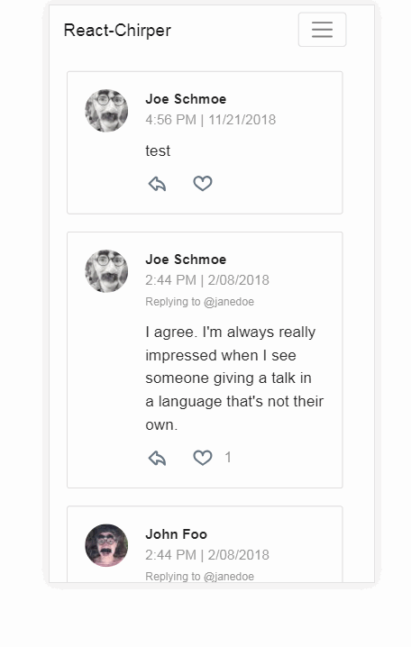

# React Chirper
Super simple twitter-like demo application built with ReactJS.    

**Demo:** https://eddielee394.github.io/react-chirper

## Codebase
- React 16
- React Router 4
- Redux 4, Redux Thunk
- Bootstrap 4 ([react-bootstrap](https://github.com/react-bootstrap/react-bootstrap))
- [React Moment](https://github.com/headzoo/react-moment)
- [React Spinners](https://github.com/davidhu2000/react-spinners)
- [React Toastify](https://github.com/fkhadra/react-toastify)

## Functionality
- User can like tweets
- Nested replies
- Tweets stored in Redux Store

## Usage
- Clone repo
- Run `npm install`
- Run `npm start`
- Start chirpin! 